## vitejs-vite-ddguzm

[Edit on StackBlitz ⚡️](https://stackblitz.com/edit/vitejs-vite-ddguzm)

# THE MOVIE DATABASE API 3 (TMDB VERSION 3)

## INTRODUCCION

Pagina realizada para consultar informacion sobre tus peliculas y series favoritas.
Por el momento se puede buscar por nombre o por genero de la pelicula y/o serie, ademas se puede ver mas detalle sobre las series como por ejemplo la cantidad de temporadas y capitulos por temporada.

## Link del deploy
- Proyecto en [Netlify](https://react-tmdb-api.netlify.app/ "Proyecto en netlify")  
- Proyecto en [Github](https://github.com/luisangeluis/TMDBReact "Proyecto en github")

## Frameworks
- Bootstrap 5.2.1
- Font awesome 6.2.1

## Tecnologías
- Axios 0.27.2
- Font awesome 6.2.1

## Librerias
- reduxjs/toolkit
- react-redux
- moment
- react-router-dom
- react-hook-form
- react-intersection-observer
- swiper

## Documentación. 
### **VISTA PRINCIPAL DEL MENÚ.**
- Desktop

> Estas son las vistas principales de la pagina en modo escritorio.
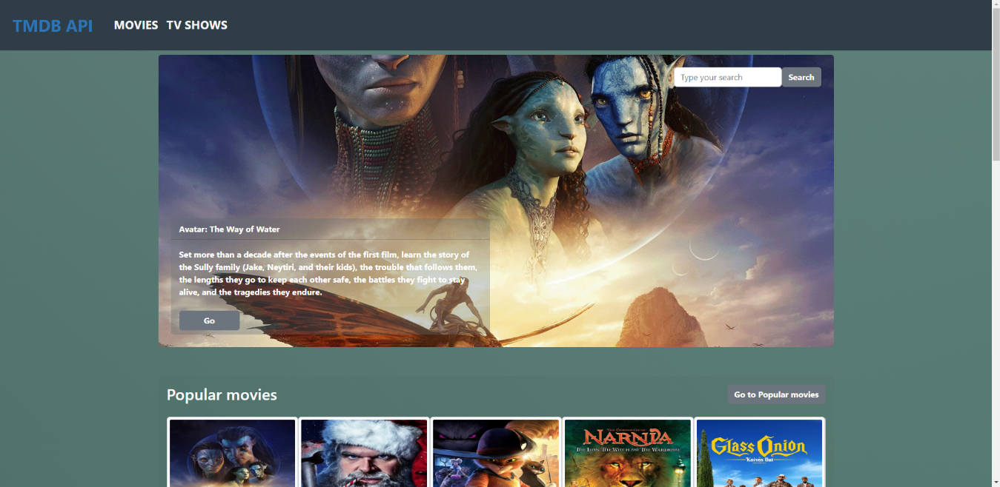
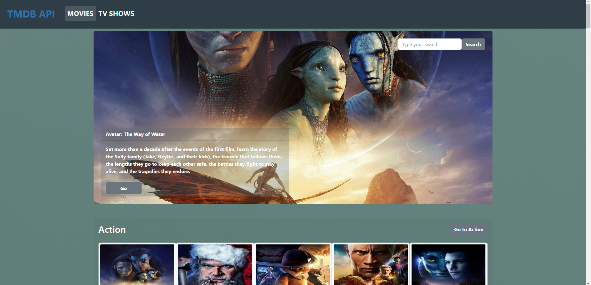

- Mobile

> Estas son las vistas principales de la pagina en modo movil.
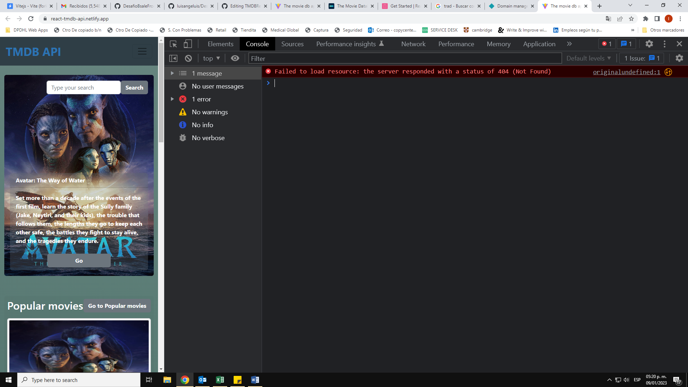
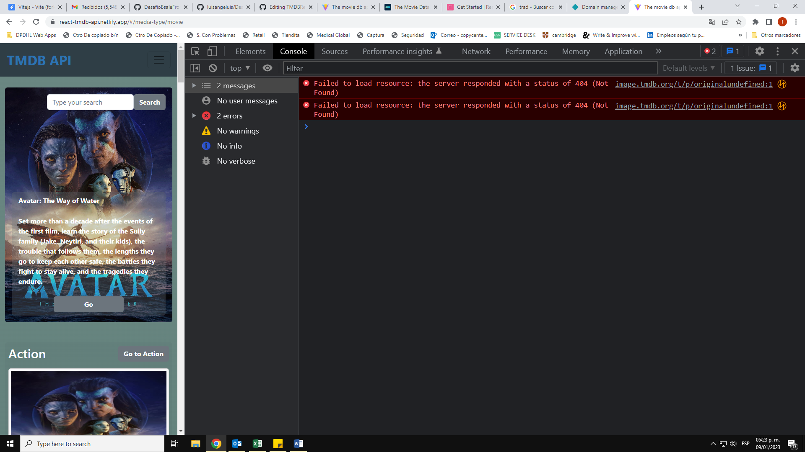

### **VISTA POR GENERO.**
- Desktop

> Aqui puedes los resultados de las peliculas o series por genero en modo escritorio.
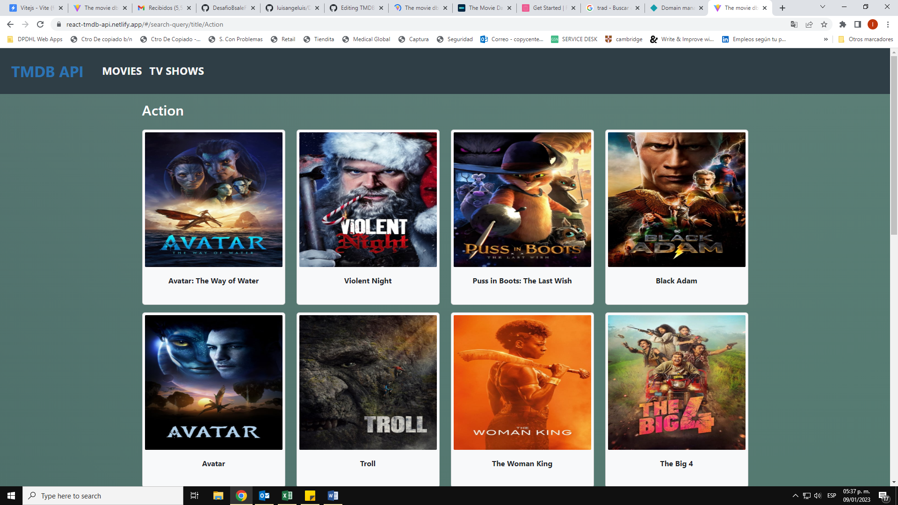

- Mobile

> Aqui puedes los resultados de las peliculas o series por genero en modo movil.
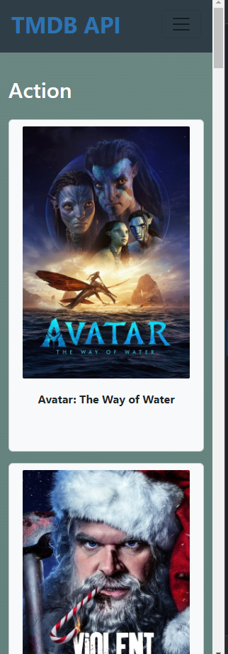

### **VISTA POR NOMBRE DE LA PELICULA O SERIE.**
- Desktop

> Aqui puedes los resultados de las peliculas o series por nombre en modo escritorio.
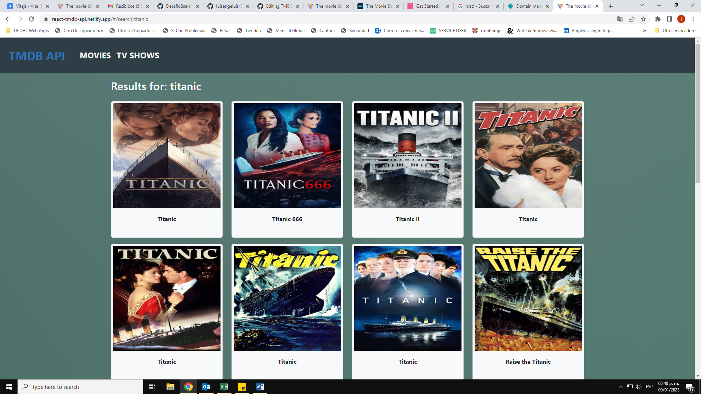

- Mobile

> Aqui puedes los resultados de las peliculas o series por nombre en modo movil.
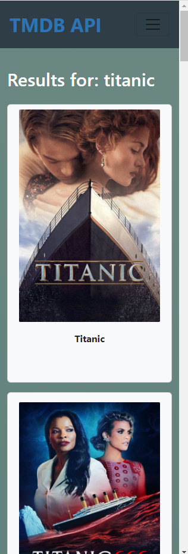

### **VISTA DETALLE DE LA PELICULA O SERIE.**
- Desktop

> Aqui aparace el detalle de la pelicula o serie en modo escritorio.
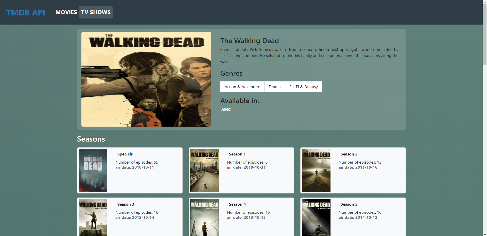
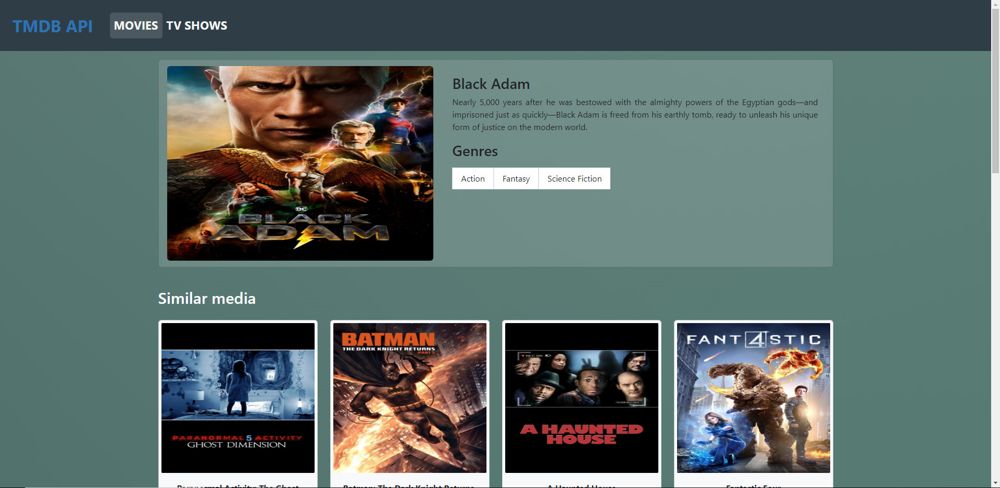

- Mobile

> Aqui aparace el detalle de la pelicula o serie en modo movil.
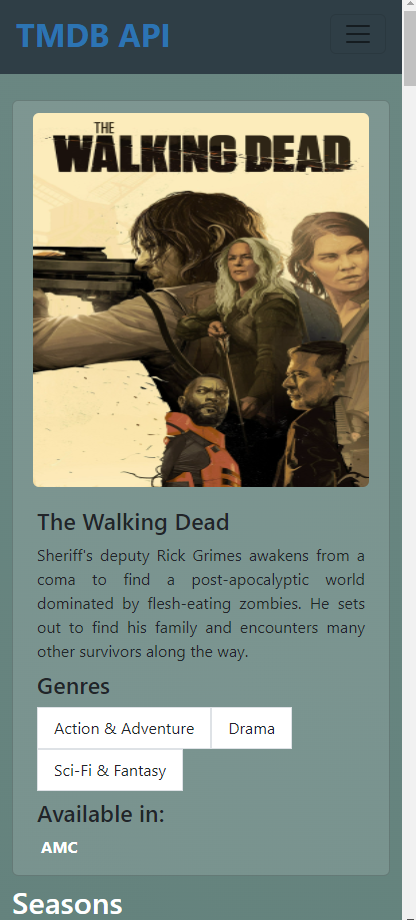
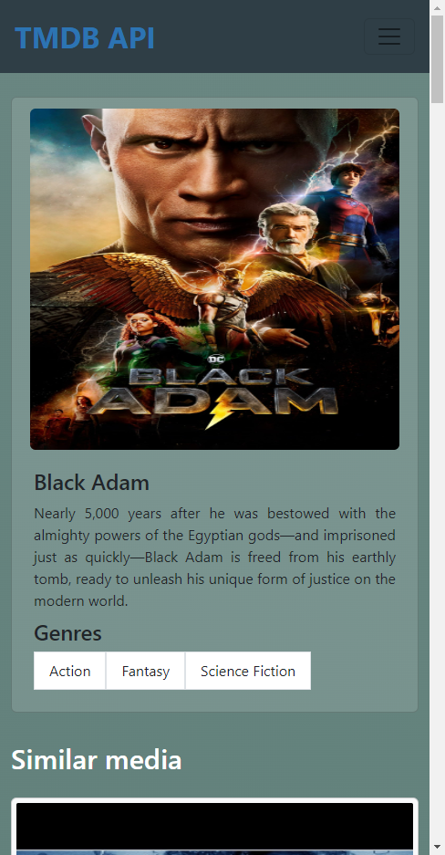

### **VISTA DETALLE DE LA TEMPORADA DE CUALQUIER SERIE.**
- Desktop

> Aqui aparace el detalle de cualquier temporada en modo escritorio.
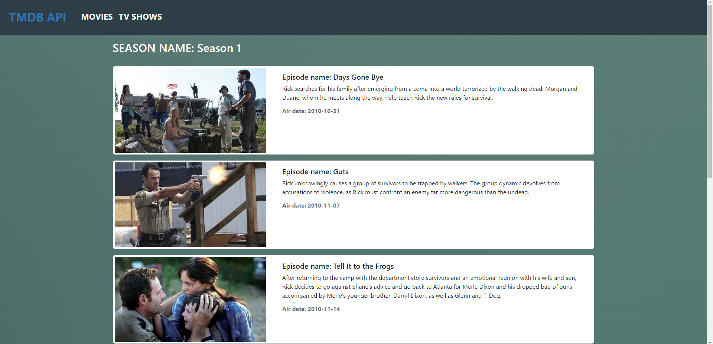

- Mobile

> Aqui aparace el detalle de cualquier temporada en modo movil.
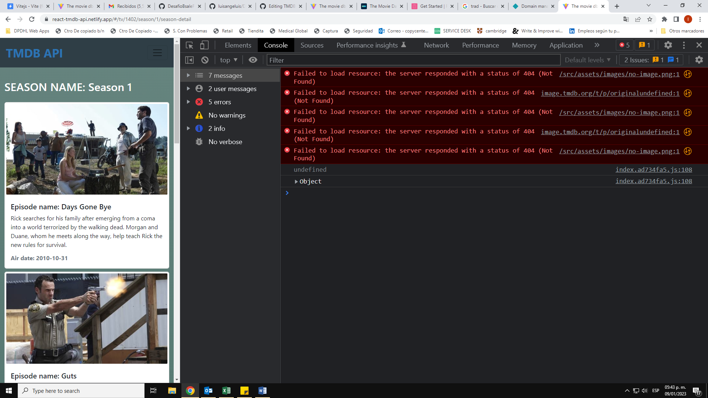

## Contribución

Puedes crear un pull request al proyecto.

## Licencia.

Licencia [MIT](https://opensource.org/licenses/MIT)

