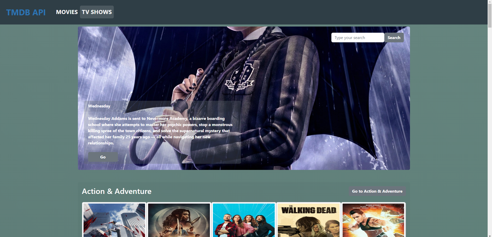
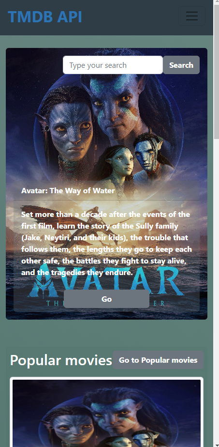
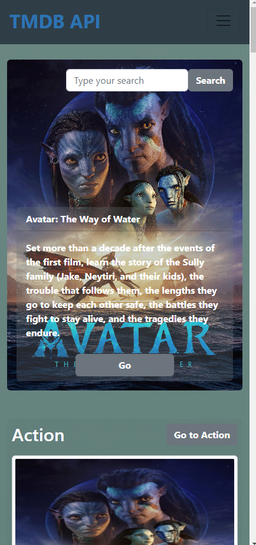
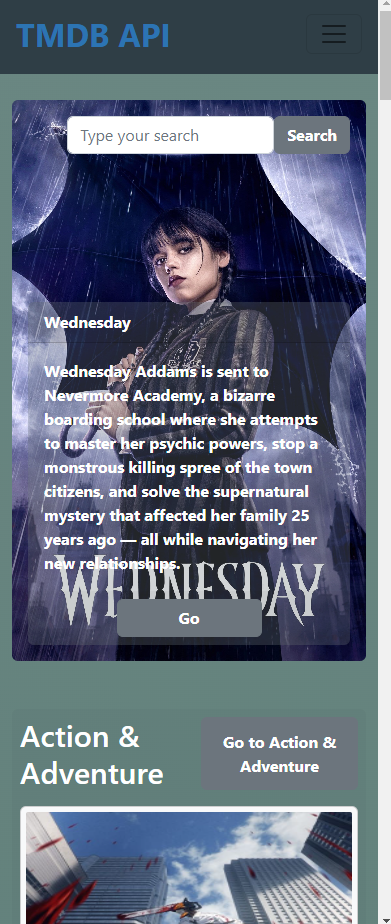
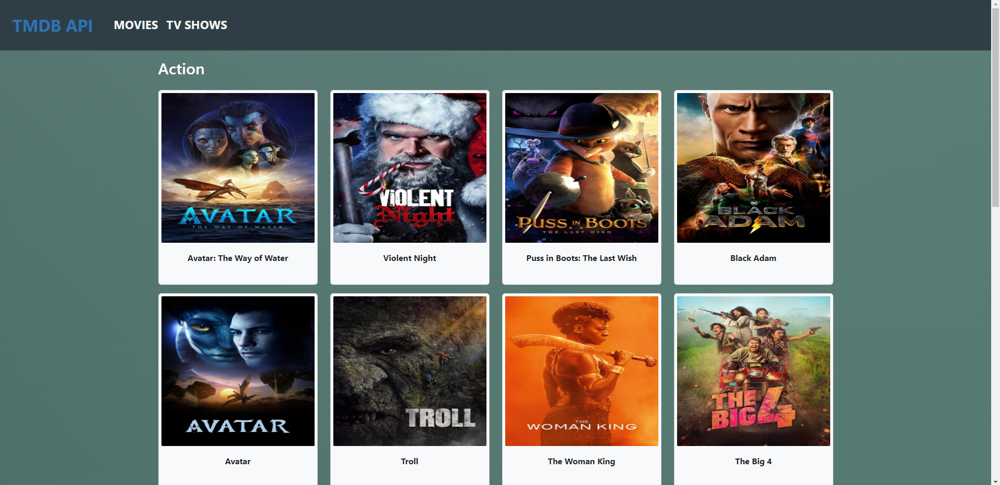
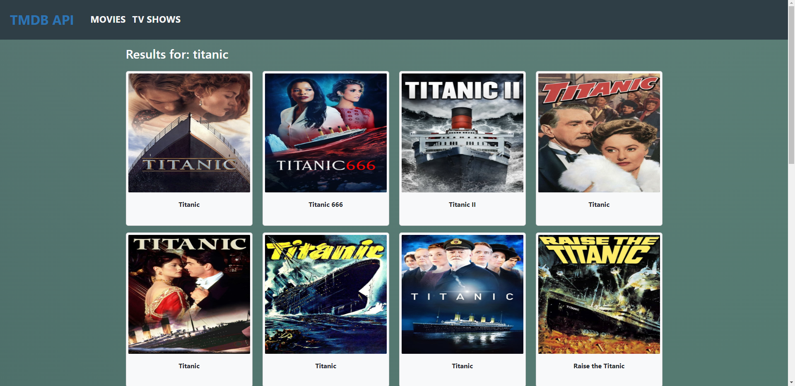

# vitejs-vite-ddguzm

[Edit on StackBlitz ⚡️](https://stackblitz.com/edit/vitejs-vite-ddguzm)

# THE MOVIE DATABASE API 3 (TMDB VERSION 3)

## INTRODUCCION

Pagina realizada para consultar informacion sobre tus peliculas y series favoritas.
Por el momento se puede buscar por nombre o por genero de la pelicula y/o serie, ademas se puede ver mas detalle sobre las series como por ejemplo la cantidad de temporadas y capitulos por temporada.

## Link del deploy
- Proyecto en [Netlify](https://react-tmdb-api.netlify.app/ "Proyecto en netlify")  
- Proyecto en [Github](https://github.com/luisangeluis/TMDBReact "Proyecto en github")

## Frameworks
- Bootstrap 5.2.1
- Font awesome 6.2.1

## Tecnologías
- Axios 0.27.2
- Font awesome 6.2.1

## Librerias
- reduxjs/toolkit
- react-redux
- moment
- react-router-dom
- react-hook-form
- react-intersection-observer
- swiper

## Documentación. 
### **VISTA PRINCIPAL DEL MENÚ.**
- Desktop

- Mobile

### **VISTA POR GENERO.**
- Desktop

- Mobile

### **VISTA POR NOMBRE DE LA PELICULA O SERIE.**
- Desktop

- Mobile

### **VISTA DETALLE DE LA PELICULA O SERIE.**
- Desktop

- Mobile

### **VISTA DETALLE DE LA TEMPORADA DE CUALQUIER SERIE.**
- Desktop
-Mobile

